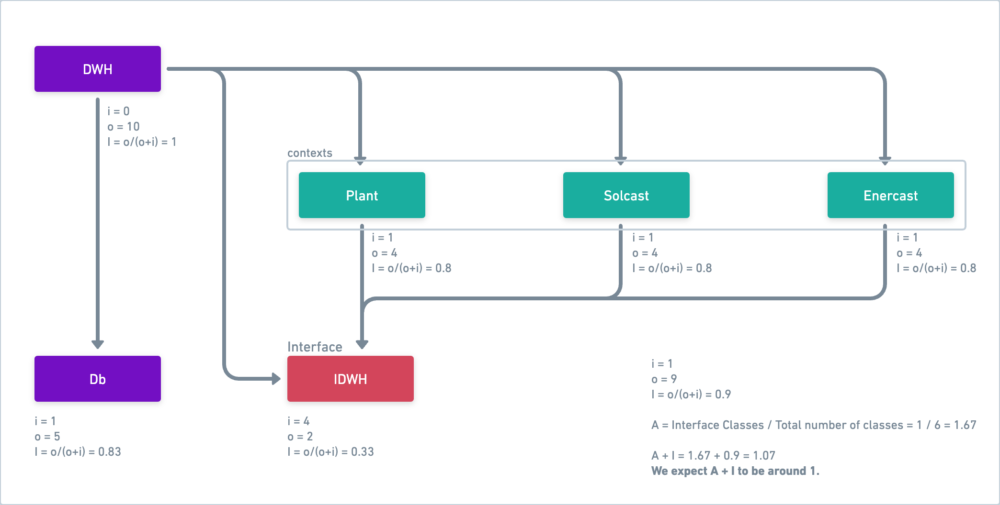

# Introduction

    Helper functions for Prediktor Map Services

Helper functions for communicating with Prediktors OPC UA ModelIndex REST-API
and OPC UA Values REST-API. Typically used for data anlytics purposes, you'll
find Jypiter Notebooks with examples in the notebooks folder.

Install is primarily done through PyPi with `pip install pyPrediktorMapClient`.
If you want to contribute or need run the Jupyter Notebooks in the `notebooks`
folder locally, please clone this repository.

# Development

If you'd like to contribute to pyPrediktorMapClient, please follow the steps below.

## Get the code

1. First clone the repository and navigate to the main folder of repository.

```
git clone git@github.com:PrediktorAS/pyPrediktorMapClient.git
```

## Setup

2. Create Virtual environment

```
python3 -m venv .venv
source .venv/bin/activate
```

3. Install dependencies
   As this is a python package, dependencies are in setyp.py _(actually in setup.cfg,
   as this is a pyScaffold project)_. Requirements.txt will perform the correct
   installation and add a couple of additional packages.

```
pip install -r requirements.txt
```

## Pre-commit Hooks

To ensure code quality and maintain a consistent coding standard, pre-commit hooks have been added to the repository. All the pre-commit checks must be passed before committing your changes. Follow the instructions below to install and use them.

4. Activate pre-commit hooks
After installing the requirements, activate the pre-commit hooks by running:

```
pre-commit install
```

5. Run pre-commit hooks manually
It's recommended to run the pre-commit hooks before making a commit to catch issues early. Use the following command to run all the hooks manually:

```
pre-commit run --all-files
```

6. Stage your changes
After making the required changes and ensuring they pass the pre-commit hooks, add the changes to the staging area before creating a commit:

```
git add .
```

## isort for Import Sorting

To maintain a clean and organized codebase, we use isort to automatically sort Python import statements according to PEP 8 standards.

7. Run isort

Run `isort` manually to sort the imports in the project using the command:

```
isort .
```

However, applying these changes could lead to conflicts. To verify the import order without making any modifications, use the following command:

```
isort . --check-only
```

The `isort` configuration is managed in the `pyproject.toml` file to ensure it integrates well with black and other tools.


## Run and build

8. Run tests

```
tox
```

9. Make your changes and submit a new PR for approval.

10. Build

```
tox -e build
```

## Changes

11. Please apply your changes. If they will facilitate the work of the person using pyPrediktorMapClient, especially the new features you've implemented, ensure that you describe your changes comprehensively and provide guidance in the README.md file under the chapter `Manual - How to Use` (check below).

12. Commit your changes to a new branch, push and create a new pull request for review.

## Publish on PyPi

13. Open [https://pypi.org/](https://pypi.org/) and log in.
14. Open [https://pypi.org/manage/account/](https://pypi.org/manage/account/) and generate a new API token but only if you don't have one already. Keep the API key on your local machine because once generated it will be visible only once. Delete API keys that are no longer used!
15. In your code editor, open the root directory of the current project and clean the content of folder `dist`.
16. Create a new tag and push it to the GitHub repository. For instance, if the latest tag is `0.6.7` the new tag should be `0.6.8`. Alternatively, if the changes are major, you can set the new tag to `0.7.0`.

Use the following commands to create the tag and to publish it.

```
git tag 0.6.8
git push origin 0.6.8
```

17. Create a new build. Be aware that `tox.ini` file is configured in a way to get latest tag from the repository. That tag is going to be used to label the new build.

```
tox -e build
```

18. Be sure that twine is installed. If not, run the following command:

```
python3 -m pip install twine
```

or

```
python -m pip install twine
```

19. Publish the build on PyPi:

```
python3 -m twine upload -u __token__ -p API_KEY dist/*
```

Replace API_KEY with the API key you generated earlier or a key you already have.

20. Check if the new version has been release - [Release history](https://pypi.org/project/pyPrediktorMapClient/#history).

Once that's done, we have to publish a new release in the GitHub repository.

21. Open the list of released published on the [GitHub repository](https://github.com/PrediktorAS/pyPrediktorMapClient/releases). Draft a new release by pressing "Draft a new release".

Use the newly created tag which in our example is 0.6.8. Add detailed descrption about the new changes.

In the descrition you can also add a link pointing to PyPi release.

Once the draft is created, publish it in order to be visible to the public.

tox -e build

Publish to PyPi test and live.

We are ready!

## Possible errors

When running `tox` command it may happen to face the following error (or similar):

```
ImportError while importing test module '/PATH_TO_PROJECT/pyPrediktorMapClient/tests/test_dwh.py'.
Hint: make sure your test modules/packages have valid Python names.
Traceback:
/Library/Frameworks/Python.framework/Versions/3.10/lib/python3.10/importlib/__init__.py:126: in import_module
    return _bootstrap._gcd_import(name[level:], package, level)
tests/test_dwh.py:4: in <module>
    from pyprediktormapclient.dwh import DWH
src/pyprediktormapclient/dwh.py:1: in <module>
    import pyodbc
E   ImportError: dlopen(/PATH_TO_PROJECT/pyPrediktorMapClient/.tox/default/lib/python3.10/site-packages/pyodbc.cpython-310-darwin.so, 0x0002): symbol not found in flat namespace '_SQLAllocHandle'
```

A possible solution is to rebuild pyodbc via:

```
pip uninstall pyodbc
pip install --force-reinstall --no-binary :all: pyodbc
```

on Mac:

```
export LDFLAGS="-L/opt/homebrew/lib"
export CPPFLAGS="-I/opt/homebrew/include"
.tox/default/bin/pip install --force-reinstall --no-binary :all: pyodbc
```

The last commands adjust the environment variables to point to your Homebrew
installation paths and then rebuild pyodbc. In that way we make sure
the build environment knows where to find the unixODBC headers and libraries.
Also, make sure to run these commands within the activated tox environment.

# Manual - How to Use

## ModelIndex

Example:

```
from pyprediktormapclient.model_index import ModelIndex
from pyprediktormapclient.opc_ua import OPC_UA

model = ModelIndex(url=your_model_index_url)
tsdata = OPC_UA(rest_url=your_opcua_rest_url, opcua_url=your_opcua_server_uri)

obj_types = model.get_object_types()
```

## DWH

### Introduction

Helper functions to access a PowerView Data Warehouse or other SQL databases. This class is a wrapper around pyodbc and you can use all pyodbc methods as well as the provided methods. Look at the pyodbc documentation and use the cursor attribute to access the pyodbc cursor.

### Architecture of the DWH component

Here is a diagram that illustrates the architecture of the DWH component:


### Initialisation

When initialising DWH you have to pass the patameters below following the same order:

- SQL_SERVER
- SQL_DATABASE
- SQL_USER
- SQL_PASSWORD

```
dwh = DWH(SQL_SERVER, SQL_DATABASE, SQL_USER, SQL_PASSWORD)
```

There is fifth parameter `SQL_DRIVER_INDEX` but it is not required. If you do not pass the driver index, pyPrediktorMapClient is going to check two things:

- All drivers supported by `pyodbc`.
- All drivers that are supported by `pyodbc` and are also installed and available on your machine.

pyPrediktorMapClient is going to choose the first one from the list of supported and available drivers. In that way, the whole process is automated for you and you can use pyPrediktorMapClient DWH class out of the box.

If you would like to pick up a particular driver you have to do the above yourself and pass the desired driver index. Here is an example how to do that. First we get a list of available drivers supported by `pyodbc`:

```
available_drivers = pyodbc.drivers()
```

Let's say that list contains the following drivers:

```
[
    'ODBC Driver 18 for SQL Server',
    'ODBC Driver 13 for SQL Server',
    'ODBC Driver 17 for SQL Server'
]
```

and you'd like to use the third one. Threfore the driver index you have to pass when initialising DWH equals 2 _(because that is the index of the driver in the list)_:

```
driver_index = 2
dwh = DWH(SQL_SERVER, SQL_DATABASE, SQL_USER, SQL_PASSWORD, driver_index)
```

### Low level usage

```
from pyprediktormapclient.dwh import DWH

dwh = DWH("localhost", "mydatabase", "myusername", "mypassword")
results = dwh.fetch("SELECT * FROM mytable")
dwh.execute("INSERT INTO mytable VALUES (1, 'test')")
```

### High level usage

#### Database version

Get the database version:

```
from pyprediktormapclient.dwh import DWH

dwh = DWH("localhost", "mydatabase", "myusername", "mypassword")
database_version = dwh.version()
```

#### Plant

```
from pyprediktormapclient.dwh import DWH

dwh = DWH("localhost", "mydatabase", "myusername", "mypassword")

facility_name = 'JO-GL'
optimal_tracker_angles = dwh.plant.get_optimal_tracker_angles(facility_name)

facility_data = {'key': 'some data'}
dwh.plant.upsert_optimal_tracker_angles(facility_data)

plantname = 'PlantName'
ext_forecast_type_key = 1
data_type = 'SomeType'
has_thrown_error = False
message = "Optional message"
dwh.plant.insert_log(
    plantname,
    ext_forecast_type_key,
    data_type,
    has_thrown_error,
    message
)
```

#### Solcast

```
from pyprediktormapclient.dwh import DWH

dwh = DWH("localhost", "mydatabase", "myusername", "mypassword")

plants_to_update = dwh.solcast.get_plants_to_update()

plantname = 'PlantName'
solcast_forecast_data = {'key': 'some data'}
dwh.solcast.upsert_forecast_data(plantname, solcast_forecast_data)
```

#### Enercast

```
from pyprediktormapclient.dwh import DWH

dwh = DWH("localhost", "mydatabase", "myusername", "mypassword")

enercast_plants = dwh.enercast.get_plants_to_update()

asset_name = 'some-asset-name'
live_meter_data = dwh.enercast.get_live_meter_data(asset_name)

enercast_forecast_data = {'key': 'some data'}
dwh.enercast.upsert_forecast_data(enercast_forecast_data)
```

## Want to know more?

Further information, documentation and module reference on
[the documentation site](https://prediktoras.github.io/pyPrediktorMapClient)
and check out the jypiter notebooks in the notebooks folder.
